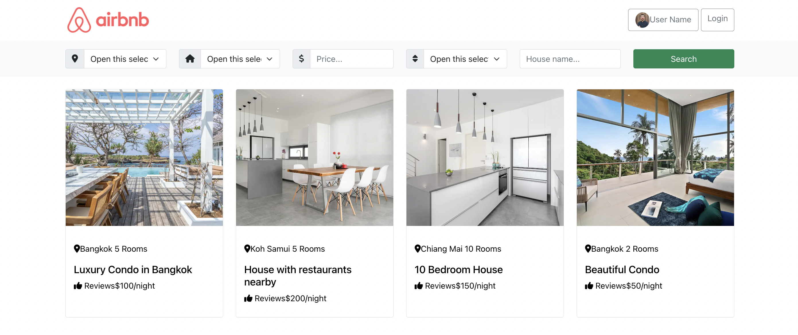
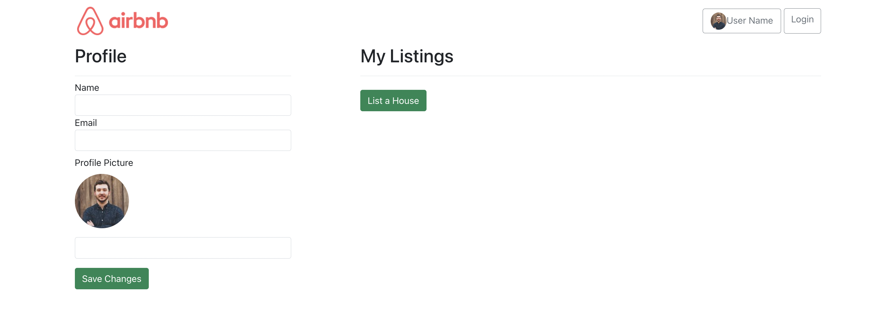

# Airbnb Clone

Welcome to the Airbnb Clone project! This project is a functional copy of Airbnb, allowing users to browse and book listings, leave reviews, and manage their own listings. It is built using modern web technologies and provides a user-friendly interface.

## Features

- User Authentication: Users can sign up and log in to the platform to access additional features.
- Home Listings: Users can browse available home listings with detailed information, including photos, descriptions, and pricing.
- Listing Management: Authenticated users can create and manage their own listings, including adding photos, updating details, and setting availability.
- Reviews: Authenticated users can leave reviews and ratings for listings they have booked.
- User Dashboard: Authenticated users have access to a personalized dashboard, where they can view their bookings and manage their profile.

## Screenshots

Here are some screenshots showcasing different sections of the Airbnb Clone:

### Home Page

The home page provides an overview of available listings and a search feature to filter results.

### User Authentication

Users can sign up and log in to access additional features, such as managing their own listings and leaving reviews.

### Reviews

Authenticated users can leave reviews and ratings for listings they have booked.

### User Dashboard

Authenticated users have access to a personalized dashboard, where they can view their bookings and manage their profile.

## User Login

## Technologies Used

The Airbnb Clone project is built using the following technologies:

- Front-end: HTML, CSS, JavaScript, React
- Back-end: Node.js, Express.js
- Database: MongoDB
- Authentication: JSON Web Tokens (JWT)
- Image Storage: Amazon S3 (or your preferred cloud storage provider)

## Getting Started

To run the Airbnb Clone project locally, follow these steps:

1. Clone the repository or download the code.
2. Navigate to the project directory using the command line.
3. Install the necessary dependencies by running the command `npm install`.
4. Set up the database connection and other environment variables as needed.
5. Start the development server with the command `npm start`.
6. Open [http://localhost:3000](http://localhost:3000) in your browser to view the app.

## Conclusion

The Airbnb Clone project provides a functional copy of Airbnb, with features for listing management, user authentication, and reviews. It demonstrates proficiency in React, Node.js, MongoDB, and other modern web technologies. Feel free to explore the code and use it as a reference or starting point for your own projects. If you have any questions or feedback, please don't hesitate to get in touch. Happy exploring!

---

This project was bootstrapped with [Create React App](https://github.com/facebook/create-react-app).

## Available Scripts

In the project directory, you can run:

### `npm start`

Runs the app in the development mode.\
Open [http://localhost:3000](http://localhost:3000) to view it in your browser.

The page will reload when you make changes.\
You may also see any lint errors in the console.

### `npm test`

Launches the test runner in the interactive watch mode.\
See the section about [running tests](https://facebook.github.io/create-react-app/docs/running-tests) for more information.

### `npm run build`

Builds the app for production to the `build` folder.\
It correctly bundles React in production mode and optimizes the build for the best performance.

The build is minified and the filenames include the hashes.\
Your app is ready to be deployed!

See the section about [deployment](https://facebook.github.io/create-react-app/docs/deployment) for more information.

### `npm run eject`

**Note: this is a one-way operation. Once you `eject`, you can't go back!**

If you aren't satisfied with the build tool and configuration choices, you can `eject` at any time. This command will remove the single build dependency from your project.

Instead, it will copy all the configuration files and the transitive dependencies (webpack, Babel, ESLint, etc) right into your project so you have full control over them. All of the commands except `eject` will still work, but they will point to the copied scripts so you can tweak them. At this point you're on your own.

You don't have to ever use `eject`. The curated feature set is suitable for small and middle deployments, and you shouldn't feel obligated to use this feature. However we understand that this tool wouldn't be useful if you couldn't customize it when you are ready for it.

## Learn More

You can learn more in the [Create React App documentation](https://facebook.github.io/create-react-app/docs/getting-started).

To learn React, check out the [React documentation](https://reactjs.org/).

### Code Splitting

This section has moved here: [https://facebook.github.io/create-react-app/docs/code-splitting](https://facebook.github.io/create-react-app/docs/code-splitting)

### Analyzing the Bundle Size

This section has moved here: [https://facebook.github.io/create-react-app/docs/analyzing-the-bundle-size](https://facebook.github.io/create-react-app/docs/analyzing-the-bundle-size)

### Making a Progressive Web App

This section has moved here: [https://facebook.github.io/create-react-app/docs/making-a-progressive-web-app](https://facebook.github.io/create-react-app/docs/making-a-progressive-web-app)

### Advanced Configuration

This section has moved here: [https://facebook.github.io/create-react-app/docs/advanced-configuration](https://facebook.github.io/create-react-app/docs/advanced-configuration)

### Deployment

This section has moved here: [https://facebook.github.io/create-react-app/docs/deployment](https://facebook.github.io/create-react-app/docs/deployment)

### `npm run build` fails to minify

This section has moved here: [https://facebook.github.io/create-react-app/docs/troubleshooting#npm-run-build-fails-to-minify](https://facebook.github.io/create-react-app/docs/troubleshooting#npm-run-build-fails-to-minify)
